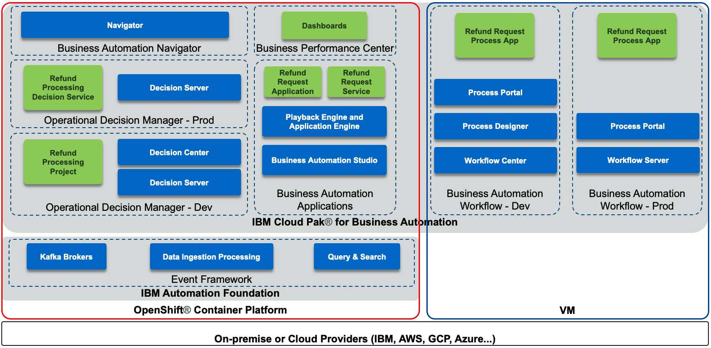
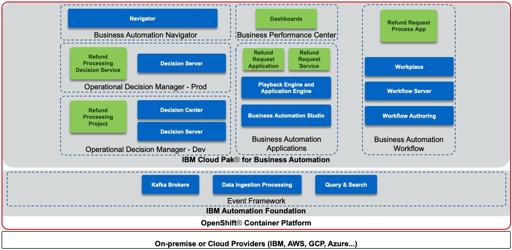

:warning: **V21.0.2 version (master) is UNDER CONSTRUCTION and not all assets are up to date or tested, please use branch 20.0.3 for the last stable version!**

***

## Refund Request use case
**an IBM Cloud Pak for Business Automation use case demo**

***

**Use Case Area:** Straight-through processing

**Use Case Overview:** Imagine that a customer purchases your product, but is unfortunately unsatisfied and requests a refund. Today, your refund process has several manual steps. Managing high volumes of refunds that require manual investigation leads to slow average completion times, inconsistent status updates to customers, and higher costs for any errors made.
This use case demonstrates the use of automation in the form of straight-through-processing to save time, money, and customer frustration.

**Choose an option:**

  * **Cloud Pak for Business Automation as a Service demo environment (likely an IBMer):** your environment is predeployed, continue to the [Getting Started Lab](https://ibm-cloud-architecture.github.io/refarch-dba/use-cases/refund-req/#getting-started-lab).
  * **Install Yourself:** To deploy Refund Request on your own environment, and technical architecture information, continue reading.

### Architecture Diagram

The following diagram illustrates the products involved and the solution components when deployed in one possible hybrid cloud architecture:

 

The following diagram illustrates the products involved and the solution components when deployed to an OpenShift based architecture:

 

### Environment

We assume the following products are installed, up and running:

* IBM Cloud Pak® for Business Automation version 21.0.2
    * Automation Foundation on OpenShift
    * Business Automation Applications (including Studio and App Engine) on OpenShift
    * Business Automation Navigator on OpenShift
    * Business Automation Workflow (BAW) on VMs or OpenShift
    * Operational Decision Manager (ODM) on OpenShift
    * Business Automation Insights (BAI) on OpenShift (Optional, can be run without)

### Deploy the artifacts

1. Determine your credentials
    1. If using Cloud Pak for Business Automation as a Service
        * You will use a single login to access BAS, BAW, ODM and BPC
        * For ODM, you will need to create a service credential/account for basic auth credentials to invoke the API to Rule Execution Server
    1. If you are deploying Refund Request on your own environment
        * Make sure you have a login to all required components
1. Deploy ODM artifacts
    1. Login to Decision Center Business console
    1. On Library, click the import icon
    1. Choose and upload Refund Processing [main] YYYY.MM.DD_XX.zip
    1. Open the main branch, click Deployments and deploy to your Rule Execution Server (adjust the server within the deployment configuration as required)
    1. Return to the branch list and click the plus sign to create a new branch based on main named Reduce Manual Processing
    1. Import Refund Processing [Reduce Manual Processing] YYYY.MM.DD_XX.zip to the new branch and choose to replace the existing elements
    1. Deploy the new branch to Rule Execution Server as a second version
1. Deploy BAW artifacts
    1. Login to Workflow Center and navigate to Process Apps or Workflow Authoring in Business Automation Studio and navigate to Business automations -> Workflows
    1. Import Refund_Request - YYYY.MM.DD_XX.twx
    1. Open the Refund Request process app / project and navigate to Process App Settings -> Servers
    1. Edit the settings for hostname, port, authentication and so forth for your ODM server
    1. (Optional) Open the BAI Generators team and add an appropriate user to the team
    1. Create a new snapshot of the process application / project
    1. Install the new snapshot to your Workflow Server unless you wish to run directly on Workflow Center's / Workflow Authoring's playback server (in SaaS, to support the optional BAI events, make sure the Workflow Server running the process app has BAI emitters enabled)
1. (Optional) Setup BAI data
    1. Login to Process Portal / Workplace with the user specified in the above BAI Generators team
    1. Click to start Generate Week 1 BAI Data RR v2 and wait for the spinner to complete in about 20 seconds
    1. Do the same for Generate Week 2 BAI Data RR v2
1. (Optional) Deploy BPC artifacts
    1. Login to Business Performance Center
    1. Import two dashboards using RefundRequest (RR) – Week 1 - YYYY.MM.DD_XX.json and RefundRequest (RR) – Week 2 - YYYY.MM.DD_XX.json
    1. Adjust the monitoring sources to the deployed BAW snapshot for the dashboard and any charts that require it
    1. Fix any charts that do not have data with the most likely error requiring is to select decimal (data > TG2 > pTime) –(float) in the Data item field which must sometimes be selected after the monitoring source is changed
1. Deploy Business Automation Studio artifacts
    1. If using Cloud Pak for Business Automation as a Service
        1. Create an external automation service named Refund_Request_Application_Services, connect it to the appropriate BAW server, select the Refund Request process and Invoke Refund Processing ODM service flow and publish
        1. Export the external automation service as a ZIP from the Business automations -> Extenal section
    1. If you are deploying Refund Request on your own OpenShift environment
        1. Publish the workflow project's snapshot in Business Automation Studio to make the automation services are available to applications
    1. Import the Refund Request application in Business applications using RefundRequest (RR) – App - YYYY.MM.DD_XX.json
    1. Create a new snapshot if needed and export the application as a ZIP
1. Deploy Business Automation Navigator artifacts
    1. Login to Business Automation Navigator's admin desktop
    1. Open and connect to the Application Engine Connection, sometimes called APPENGO
    1. If using Cloud Pak for Business Automation as a Service, import both the automation service and application ZIP files
    1. If you are deploying Refund Request on your own OpenShift environment, import the application ZIP file
    1. Edit the details of the application and add appropriate teams to the Permissions table
    1. Edit the desktop of your choice and on the Layout tab, add the application

## Contributors
  * Lead content developer [Jeff Goodhue](https://www.linkedin.com/in/jeffreygoodhue/)
